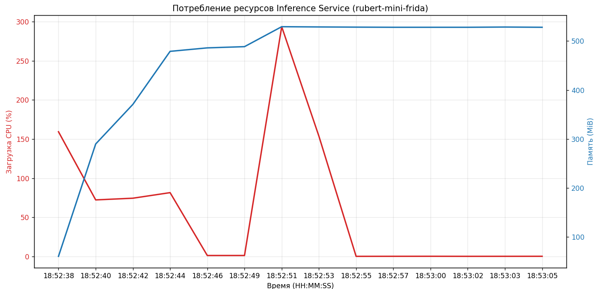

# Отчет по реализации Inference Service 

Модель: rubert-mini-frida

## Часть 1: Выбор фреймворка
Для реализации выбран FastAPI.
* Обоснование: Я думал, что все им пользуются... Высокая производительность, асинхронность, автоматическая генерация документации и тд.

## Часть 2: Выбранные метрики

| Метрика | Значение для сервиса | Целевой порог | Действия при нарушении |
| :--- | :--- | :--- | :--- |
| Latency (P50/P95/P99) | Время отклика | P95 < 100 мс | квантизация, GPU |
| Throughput (RPS) | Пропускная способность (запросов в секунду). | > 30 RPS | Горизонтальное масштабирование |
| Memory Usage | Потребление RAM | < 1 ГБ | купить память... |
| CPU Usage | Нагрузка на процессор| < 80% | Ограничение количества воркеров, оптимизация операций |

## Часть 3: Результаты бенчмарка

Замеры проводились на 100 последовательных запросах к модели, развернутой в Docker-контейнере.

### Статистика времени отклика и пропускной способности
| Показатель | Результат |
| :--- | :--- |
| Latency P50 | 18.47 ms |
| Latency P95 | 28.81 ms |
| Latency P99 | 37.81 ms |
| Throughput | 50.74 RPS |

### Потребление ресурсов (Docker Stats)
* Memory (Baseline): ~400 MiB (стабильно после загрузки весов).
* CPU (Peak): ~300% (в момент инициализации и пиковой нагрузки инференса)

## Часть 4: Анализ результатов
1. Стабильность: Разница между P50 и P99 минимальна (менее 20 мс)  - отсутствие значительных задержек в сетевом слое и планировщике задач.
2. Производительность: Текущая конфигурация на CPU полностью удовлетворяет требованиям real-time обработки текста (отклик менее 40 мс).
3. Ресурсы: Модель `rubert-mini-frida` является легковесной, что позволяет развертывать сервис на инстансах с малым объемом RAM

## Инструкция по запуску
1. Сборка образа: `docker build -t my_inference_service .`
2. Запуск контейнера: `docker run -p 8080:8000 my_inference_service`
3. Проверка: `GET http://localhost:8080/health` и `POST http://localhost:8080/embed` с JSON телом `{"text": "your text"}`.